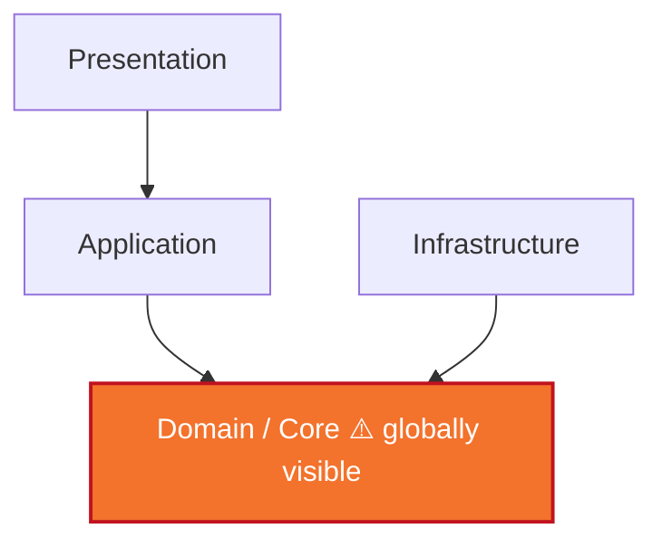
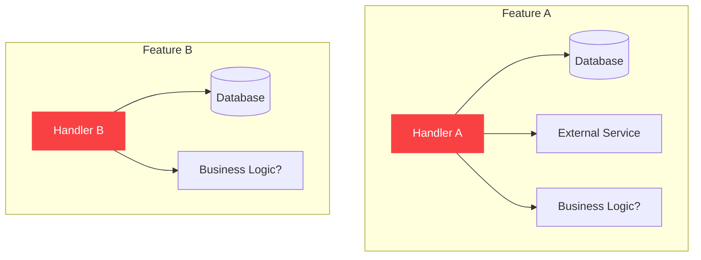
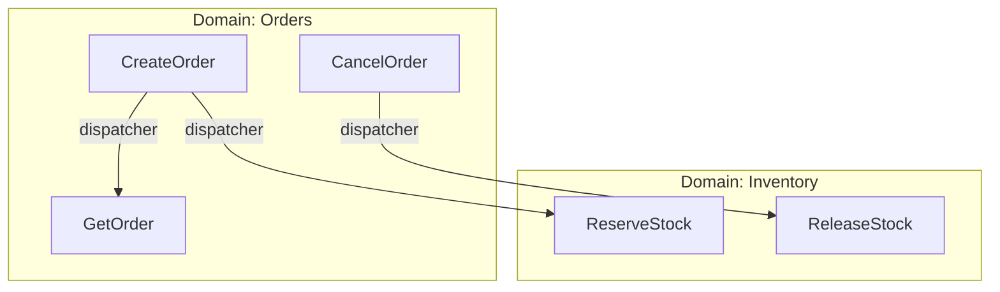
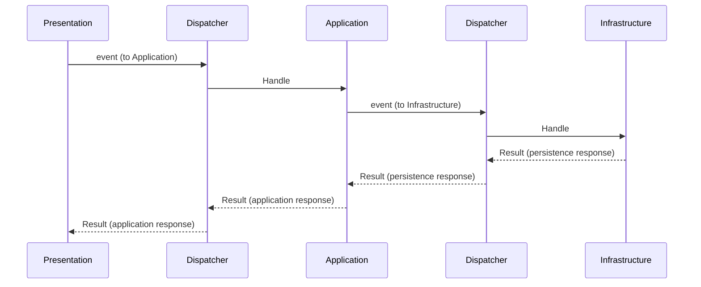
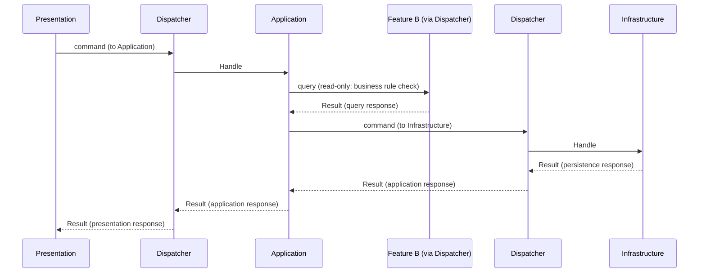
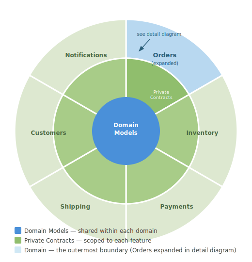
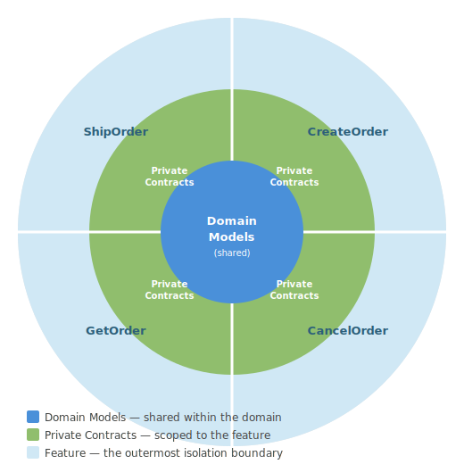

# Your Architecture Isn't Broken. It Never Had Teeth.

I once sat across from a solution architect and pointed out something that had been quietly bothering me. We were running a Clean Architecture setup, and the Presentation layer had to reference every other project in the solution — Infrastructure, Application, Domain — just to wire up the service collection. It was a direct dependency on everything the architecture was supposed to protect against.

His answer stopped me cold.

*"While that may be true, this is close enough to the theory."*

Close enough.

I've been thinking about that answer ever since. Not because it was wrong — it was, technically, defensible. But because it revealed something uncomfortable: the architecture was never really enforced. It was a convention. A shared understanding that everyone would voluntarily do the right thing. And as long as teams were small, senior, and disciplined, that was *almost* fine.

Then AI coding assistants arrived. And "close enough" stopped being acceptable.

---

## AI Didn't Break Your Architecture

When developers first started using AI assistants seriously, a pattern emerged. The AI produced plausible, compiling, even test-passing code that quietly violated every boundary the team cared about. Infrastructure services injected into presentation handlers. Domain contracts imported across feature boundaries. The layering aspirations of the architecture silently ignored — not out of malice, but because the AI had no way to know the rules existed.

The instinct was to blame the tool. But that's the wrong diagnosis.

The AI didn't break your architecture. It revealed that your architecture was enforced by nothing but convention and good intentions. The moment you introduced an agent that optimises for "does it compile and run?" rather than "does it follow our agreed patterns?" — the gap between your architecture's theory and its reality became impossible to ignore.

This is the problem Sliced Core Architecture was built to solve.

---

## What's Actually Wrong With Clean Architecture and VSA

To understand Sliced Core Architecture, you need to understand precisely what it's reacting to.

**Clean Architecture** has a global Core layer. Domain interfaces, entities, and contracts live in a shared project that every other layer references, directly or indirectly. This is intentional — it is how the architecture achieves its inward dependency rule. But it means any layer can see any contract. There is nothing stopping a developer — or an AI — from reaching across feature boundaries and consuming a domain model that was never meant to be shared. The rule against it is a convention. There is no compiler error. There is no CI failure. There is just a code review that may or may not catch it.

**Vertical Slice Architecture** solves the feature coupling problem well. Each feature is a self-contained slice with its own request, handler, and response. Features don't know about each other. That's genuinely good.

But VSA has no opinion about what happens *inside* a feature. There are no enforced layers. A handler can reach directly into the database, skip business validation, or call external services inline. The architecture gives you isolation between features and nothing else. Under deadline pressure — or with an AI optimising for brevity — a VSA codebase quietly collapses into a collection of god-functions, one per endpoint.

Both architectures have the same fundamental problem: their rules are advisory. They rely on developers to voluntarily follow conventions that the toolchain will never enforce.

---

## Sliced Core Architecture

Sliced Core Architecture is built on a single conviction: **architecture rules should be enforced at compile time, not in code reviews.**

The architecture has three structural ideas.

### 1. Domains and Features

The application is divided into **Domains**. A domain is a bounded context — a cohesive set of related features. Within a domain, features are the primary unit of isolation.

A **Feature** is a complete vertical slice that handles one operation. Features have no direct knowledge of each other — not even features within the same domain. There are no shared utilities, no cross-feature type references, and no direct calls between features. When a feature needs data or behaviour that belongs to another feature, it requests it through the dispatcher. The owning feature's full pipeline runs and returns a typed response. The coupling goes through the dispatcher, not through shared code, and this is enforced — not merely encouraged.

This design serves two purposes. First, **predictability**

### 2. Enforced Internal Layers

Unlike VSA, every feature in Sliced Core Architecture has three mandatory internal layers:

- **Presentation** — the endpoint, request validation, and input/output mapping
- **Application** — business logic and domain validation
- **Infrastructure** — persistence, external services, and I/O

These layers are not suggestions. They are enforced through the dependency injection system. Each layer's services are registered under a unique key, and resolving a service from the wrong layer is not a pattern violation — it is a runtime exception. The compiler and the DI container are the architecture's enforcers.

Layers communicate exclusively via a dispatcher. Presentation cannot call Application directly. Application cannot call Infrastructure directly. The only path between layers is through the dispatcher, using typed events. There is no other path.

Presentation has no cross-feature dispatch surface at all. It can only forward to its own feature's Application layer. The ability to reach other features through the dispatcher belongs exclusively to Application and Infrastructure — and even then, each layer is restricted to its permitted event type. That restriction is what Section 3 covers.

### 3. CQRS as a Layer Contract

Most discussions of CQRS treat it as an application-level concern: separate read models from write models, use different handlers for queries and commands. That is useful, but it misses something more powerful — using CQRS as a layer-enforcement mechanism.

In Sliced Core Architecture, every event passed through the dispatcher is typed as either a **command** or a **query**. This is not a convention. It is a structural contract enforced by the dispatcher itself.

Every layer-to-layer dispatcher call is typed as one or the other at compile time. The architecture assigns them across two distinct contexts:

**Within a feature** — the event type is determined by how the feature itself is classified:

- A **command feature** handles an operation that changes state. Every event dispatched between its layers — Presentation to Application, Application to Infrastructure — is a command.
- A **query feature** handles a read operation. Every event dispatched between its layers is a query.

The feature's classification is declared once and flows through the entire feature. There is no mixing.

**Across features** — when a feature needs to reach *outside itself*, stricter rules apply regardless of the feature's own classification:

- **Application → other features**: always a query. The Application layer is responsible for business logic and validation — it must not trigger write operations in other features. If it did, it would be committing state changes in other parts of the system before its own business logic has completed and before it has dispatched to its own Infrastructure layer for persistence. A failure at any later point would leave the system in an inconsistent state with no clean way to roll back what was already triggered elsewhere.
- **Infrastructure → other features**: always a command. If Infrastructure were permitted to query other features, it would open a direct path to making decisions based on data that was never passed through any business validation. Logic that belongs in the Application layer would quietly migrate into Infrastructure, and the validation guarantees on which the architecture is built would erode without a single rule being visibly broken.

The significance of this is not the CQRS pattern itself — it's the enforcement. A query event, by contract, cannot mutate state. A command event on the Application → Infrastructure boundary cannot be substituted with a query. The types are different. The compiler rejects the wrong one.

This closes a gap that layer-scoped access control alone cannot close. Without typed event contracts, a feature's Application layer could in principle dispatch a command directly to another feature's Infrastructure layer — bypassing presentation, skipping business validation, and mutating state from the wrong layer. With command and query enforced as distinct types at every event boundary, the dispatcher becomes the architecture's type checker. There is no convention to violate. There is only a type mismatch that will not compile.

The rule is simple: **Application queries. Infrastructure commands.**

#### Typed Dispatch Surfaces

Declaring the CQRS rule is not enough. The architecture also enforces *where* each type of dispatch can originate from. Each layer is given access to a distinct dispatch surface, and that surface only exposes the event type the layer is permitted to use.

Application layer handlers have access only to a query dispatch surface. There is no way to issue a command from it — not because issuing a command is discouraged, but because the method does not exist on the type. Infrastructure layer handlers of command features have access only to a command dispatch surface. There is no way to issue a query from it for the same reason.

The underlying dispatcher is not directly accessible from any layer handler. The only paths out are the typed surfaces, and each is available only in the layer where it belongs. The wrong call is not a mistake waiting to be caught — it is an expression that will not compile.

#### The Final Layer: Blocking Queries from Commanding

There is one remaining gap. Query and command features share the same infrastructure layer base. Without further restriction, a query feature's infrastructure layer could theoretically access the command dispatch surface — issuing a cross-feature command from what is supposed to be a read-only pipeline.

The architecture closes this at compile time. For query features, the command dispatch surface is present in the type hierarchy but deliberately inaccessible. Any attempt to use it produces a hard compiler error. The surface is visible and unreachable at the same time. There is no workaround.

Command feature infrastructure layers carry no such restriction. Cross-feature command dispatch is exactly what infrastructure orchestration is supposed to do.

This is what layered enforcement looks like in practice: not a linting rule, not a code review comment, not a naming convention — a structural decision that makes the wrong code impossible to compile.

### 4. The Private Core — The Key Differentiator

This is where Sliced Core Architecture diverges from every architecture that preceded it.

In Clean Architecture, the Core is a shared global layer. In VSA, domain contracts are typically shared across the solution. In both cases, any developer — or any AI — can import a domain contract from anywhere and use it anywhere.

In Sliced Core Architecture, **there is no shared Core layer.**

Every feature has its own private Core — a set of contracts that are scoped to that feature alone. They live inside the feature's own scope and cannot be referenced from any other feature, even within the same domain. They are structurally invisible to everything outside their own slice.

Domain models are different. They are shared within a domain — all features in a domain have visibility of the domain's models. What is private per feature are the contracts that describe how data enters and exits that feature: its request and response shapes, its layer-to-layer event types. Those belong to the feature and nothing else.

This is what makes Sliced Core Architecture resilient to AI-assisted development. There is no global contract surface to hallucinate imports from. There is no shared domain model that can be accidentally reused across domain boundaries. Each feature is a sealed unit, and the structure of the code makes it impossible to treat it as anything else.

---

## The Source Generator: Making It Viable

Strict enforcement comes with a cost. Every feature requires layer contracts, typed events, handler wiring, and domain model registration — all of it consistent, all of it structural. Writing that by hand for every feature would be exhausting and error-prone in exactly the ways the architecture is designed to prevent.

This is why the source code generator is not optional tooling. It is load-bearing infrastructure.

The source code generator produces — at compile time — every piece of boilerplate the architecture requires: concrete data transfer records, typed dispatcher events, handler wiring, and persistence model registration. Domain contracts are annotated with attributes. The generator does the rest.

Without it, the architecture would be too demanding to apply consistently. With it, the boilerplate is always correct, always consistent, and never something a developer or AI assistant needs to get right by hand. It is what makes the architecture viable in practice.

---

## Does It Actually Work?

The real test is not whether the architecture holds when an experienced developer is paying attention. It is whether it holds when someone unfamiliar with the codebase — a new team member, or an AI assistant — is asked to add a feature.

They cannot inject a service from the wrong layer. The DI system will not resolve it. They cannot reference a contract from another feature. It does not exist in their scope. They cannot skip the dispatcher and call Application logic directly from Infrastructure. The type hierarchy does not allow it.

The only code they can write is code that conforms to the architecture. Not because they were told to. Not because there is a linting rule. Because the structure of the code makes non-conforming code impossible to compile.

That is the difference between a convention and a constraint.

---

## Architecture Should Be a Constraint, Not a Convention

The moment your architecture depends on developers — or AI agents — voluntarily following rules that nothing enforces, you have a convention masquerading as an architecture. It holds under ideal conditions. It collapses under pressure, inexperience, or the well-intentioned code generation of an AI that has never read your design decisions.

Sliced Core Architecture is a bet that compile-time enforcement is worth the structural investment. That a private Core per feature is worth the boilerplate a source code generator eliminates. That the inability to violate a layer boundary is more valuable than the freedom to do so.

"Close enough" is not an architecture. It is a risk deferred.

---

## Try It

The reference implementation is open source: **[github.com/Brutiquzz/Templates](https://github.com/Brutiquzz/Templates)**

Clone it. Generate a feature. Then try to violate a layer boundary. Inject an infrastructure service into a presentation handler. Reference a contract from another feature. Issue a cross-feature command from a query feature's infrastructure layer.

See what happens.

---

*Sliced Core Architecture is under active development. Feedback, critique, and contributions are welcome.*
